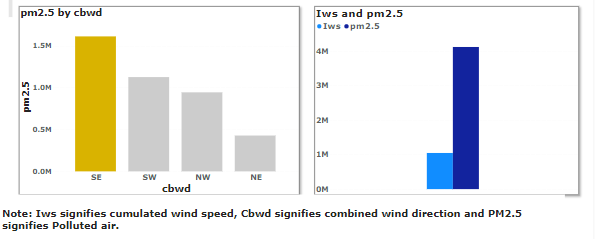

# Impact-Of-Weather-Condition-On-Air-Quality

# Introduction

Beijing and a substantial part of China are experiencing chronic air pollution. The main pollutants are fine particles of PM2.5. PM2.5 consists of airborne particles that are known to influence visibility, human health and even climate. Evidence shows that exposure to PM2.5 can cause lung morbidity , serious respiratory and cardiovascular diseases, and even death This analysis provides a set of statistical measures for key aspects of the PM2.5 pollution, on different season and weather conditions as well as its historical impact.

# Situation

A company in the environmental consulting industry is seeking to analyze the air quality in a specific city during hot and cold weather, during high-wind conditions and during precipitation. They are interested in making recommendations to the government and businesses in the region on how to mitigate the impact of weather conditions on air quality.

# Task 

The dataset consist of a table in CSV format which was provided in a Microsoft article by Oyinbooke a Senior Cloud Advocate, Click here for the #dataset.The dataset time period is between Jan 1st, 2010 to Dec 31st, 2014. 
Attribute Information:
Year: Year of data in this row
Month: Month of data in this row
Day: Day of data in this row
Hour: Hour of data in this row
PM2.5: PM2.5 concentration (ug/m³)
DEWP: Dew Point (℃)
TEMP: Temperature (℃)
PRES: Pressure (hPa)
Cbwd: Combined wind direction
Iws: Cumulated wind speed (m/s)
Is: Cumulated hours of snow
Ir: Cumulated hours of rain

**For this challenge, the task is to build a single-page dashboard to analyze the historical impact of weather conditions on air quality, and make predictions on air quality during specific weather conditions, seek insights and make recommendations to achieve the set objectives.**

# Action

**For this analysis, I used Power BI to build interactive dashboard, create measures, charts and visualization. After analyzing the dataset I was able to identify how PM 2.5 affected different weather conditions and seasons with it's historical impact. A few of them are highlighted below, while others can be further explored in the final dashboard.**

###### Historical impact of PM 2.5
The first visual on the dashboard is the historical impact of PM 2.5 within the years starting from Jan 1st, 2010 to Dec 31st, 2014. As seen in the visual, year 2013 and 2014 records the most impacted by PM 2.5 which was due to emission of waste and by-product from manufacturing companies. Oct, Jan and Feb months records the highest while Apr, May and Aug months records the least affected by air pollution.

 ###### Impact of PM2.5 on Seasons

 

You can see from the visual above the seasons with high concentration of PM 2.5. Winter season records the most polluted with 117.12 Ug/m3. Jan and Feb of the winter season records the most impacted. Autumn season is the second most polluted with Oct and Nov records the most impacted.

###### Impact of PM2.5 on Weather Condition(rain & snow)

During rainy days its unlikely we have polluted air, as seen in the visual the concentration of PM2.5 reduces with high rainfalls and gradually increase in the absence of rain. Polluted air is high when the temp is reduced(Snowy days). As seen in the visual, the lower the temp the higher the concentration of PM2.5 meaning there is high tendency of polluted air during snow.

###### Impact of PM2.5 on Weather Condition(Wind)

During windy days, there is a high tendency of polluted air as seen in the visual. The more the wind speed the higher the concentration of PM2.5. Furthermore, PM2.5 is directly mostly toward the SE as compared to other regions.

###### Impact of PM2.5 on Temperature and Dewpoint

Temperature and PM2.5 is inversely proportional, During High temperature concentration of PM2.5 reduces, while during low temperature, the concentration of PM2.5 increases as seen in the visual. Dewpoint as seen is only going up during the summer time. High dew point means unlikely to have rains and snows.

###### Recommendations

Based on analysis from different graphs and charts, winter season are usually cold, dry with high PM 2.5, visiting at these month season(Dec, Jan and Feb) is not advisable. Summer seasons when it's hot, warm and less polluted are best for recreative and exploratory activities. July and August experience the hottest month while January and December has the coldest month. Jan, Feb,Oct and Dec months has the most polluted air while months with high rain(July, Aug, Sept) experience low/no polluted air, agriculture is favorable. Despite high pollution in winter season, ski driving are awesome experience for the sport lovers.

###### Result

###### _Dashboard_

I created a dashboard to better explore each point at a glance. A preview of the interactive dashboard is shown below. Each chart highlight actionable point derived based on analysis. The dashboard is all you need to determine the condition of air pollution on weather days and season which will help mitigate the effect caused by pm2.5. For business owners and entrepreneurs' who are venturing on starting a business that is dependent on weather conditions, this analysis is all you need for a predictive plans and forecast.

###### _Conclusion_

To conclude, some of the highlight of this analysis include :
Winter season are usually cold, dry with high PM 2.5, visiting at these month season(Dec, Jan and Feb) is not advisable
Summer seasons are hot, warm and less polluted are best for recreative and exploratory activities
Windy weather have high level of polluted air, this can cause serious havoc on health.

